# DSO202 Practical 5: Managing Kubernetes Configuration with Kustomize

## 1. Objective

The aim of this practical was to use **Kustomize** (built into `kubectl`) to manage the same application across several environments without copying and editing full YAML files. The work covered:

1. Creating a multi-node local Kubernetes cluster with `kind`.
2. Building a reusable **base** (Deployment, Service, ConfigMap generator).
3. Creating **overlays** for `dev`, `staging`, `prod`, `qa` and `sandbox` that change only what differs per environment (namespace, labels, replicas, image tag, resources, annotations, page content).
4. Previewing output with `kubectl kustomize`, comparing environments with `diff`, and deploying with `kubectl apply -k`.
5. Verifying the running workloads and demonstrating how a configuration change triggers a rollout.

---

## 2. Repository Structure

```text
dso202_prcatical_5/
├── kind-config.yaml
├── evidence/                   
└── examples/webapp/
    ├── base/
    │   ├── deployment.yaml
    │   ├── service.yaml
    │   ├── kustomization.yaml
    │   └── index.html
    └── overlays/
        ├── dev/         (kustomization.yaml, namespace.yaml, index.html)
        ├── staging/     (kustomization.yaml, namespace.yaml, index.html)
        ├── prod/        (kustomization.yaml, namespace.yaml, patch-resources.yaml, index.html)
        ├── qa/          (kustomization.yaml, namespace.yaml, patch-annotation.yaml, index.html)
        └── sandbox/     (kustomization.yaml, index.html)
```

---

## 3. Environment Setup

### 3.1 Cluster configuration

`kind-config.yaml` defines a cluster with one control-plane node and two workers:

```yaml
kind: Cluster
apiVersion: kind.x-k8s.io/v1alpha4
nodes:
  - role: control-plane
  - role: worker
  - role: worker
```

### 3.2 Cluster creation

```bash
kind create cluster --name kustomize-lab --config kind-config.yaml
```

The output shows every stage completing (node image, preparing nodes, writing configuration, starting control-plane, installing CNI and StorageClass, joining worker nodes) and the context `kind-kustomize-lab` being set.

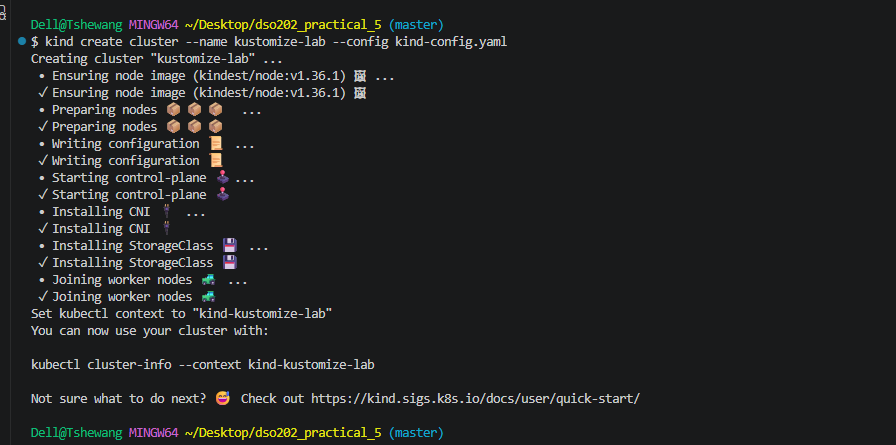

### 3.3 Cluster verification

```bash
kubectl cluster-info --context kind-kustomize-lab
kubectl get nodes -o wide
```

All three nodes (`kustomize-lab-control-plane`, `kustomize-lab-worker`, `kustomize-lab-worker2`) report `Ready` on Kubernetes **v1.36.1**, with the control plane and CoreDNS reachable.

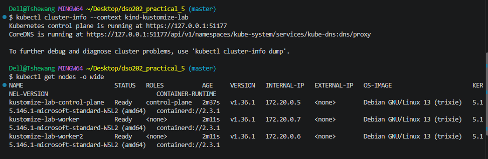

### 3.4 Tool versions

```bash
kubectl version --client -o yaml
```

The client is `kubectl` **v1.32.2** with **Kustomize v5.5.0** built in.

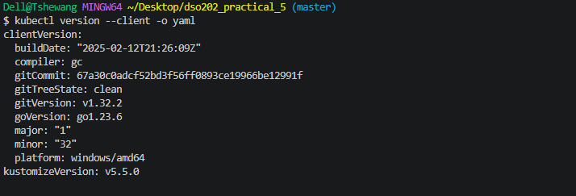

---

## 4. The Base

The base holds the parts of the application that are the same in every environment.

**`base/deployment.yaml`** – an NGINX Deployment with 1 replica, image `nginx:1.25`, small CPU/memory requests and limits (50m/32Mi and 100m/64Mi), and a volume that mounts a ConfigMap named `web-content` at `/usr/share/nginx/html`.

**`base/service.yaml`** – a ClusterIP Service exposing port 80 to the pods selected by `app.kubernetes.io/name: webapp`.

**`base/kustomization.yaml`** – lists both resources and uses a `configMapGenerator` to turn `index.html` into the `web-content` ConfigMap:

```yaml
configMapGenerator:
  - name: web-content
    files:
      - index.html
```

### 4.1 Rendering the base

```bash
kubectl kustomize examples/webapp/base
```

The rendered output contains a ConfigMap (with the text "BASE page - should never be seen in a real environment"), a Service and a Deployment. The ConfigMap name carries a generated hash suffix (`web-content-5f62m4hht5`).

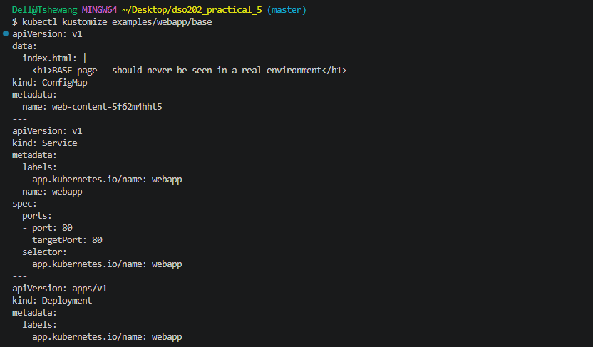

### 4.2 Checking kinds and name rewriting

```bash
kubectl kustomize examples/webapp/base | grep '^kind:'
kubectl kustomize examples/webapp/base | grep 'name: web-content'
```

The first command confirms the three kinds (`ConfigMap`, `Service`, `Deployment`). The second shows the ConfigMap is named `web-content-5f62m4hht5`, while the Deployment's volume reference was **automatically rewritten** to the same hashed name. This is how Kustomize keeps references consistent when it generates ConfigMaps.

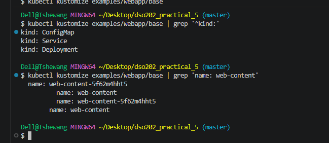

---

## 5. Overlays and Environment Comparison

Each overlay points to `../../base` and layers environment-specific changes on top.

| Overlay | Namespace | Replicas | Image tag | Extra customisation |
|---|---|---|---|---|
| dev | `webapp-dev` | 1 | `nginx:1.25-alpine` | `environment: dev` label |
| staging | `webapp-staging` | 2 | `nginx:1.25-alpine` | `environment: staging` label |
| qa | `webapp-qa` | 2 | `nginx:1.25-alpine` | `environment: qa` label, JSON patch adding annotation `training.example.com/owner: qa-team` |
| prod | `webapp-prod` | 3 | `nginx:1.26-alpine` | `environment: prod` label, strategic-merge patch raising resources and adding annotation `training.example.com/tier: production` |
| sandbox | `webapp-sandbox` | 1 (base) | `nginx:1.25` (base) | `sandbox-` name prefix, no namespace or label transformers |

### 5.1 Building the dev overlay

```bash
kubectl kustomize examples/webapp/overlays/dev
```

The output shows the `webapp-dev` Namespace with label `environment: dev`, and a ConfigMap `web-content-m426g2f8g7` in the `webapp-dev` namespace whose page reads "Hello from the DEV environment".

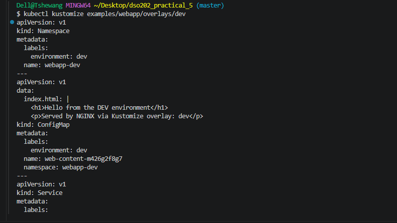

### 5.2 Saving dev and prod output for comparison

```bash
kubectl kustomize examples/webapp/overlays/dev  > /tmp/webapp-dev.yaml
kubectl kustomize examples/webapp/overlays/prod > /tmp/webapp-prod.yaml
```

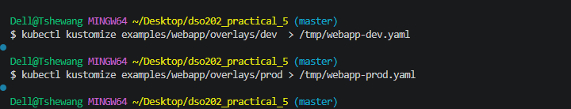

### 5.3 Comparing dev and prod

```bash
diff -u /tmp/webapp-dev.yaml /tmp/webapp-prod.yaml || true
```

The diff shows exactly where the environments differ and nothing else:

- Namespace name and `environment` label (`webapp-dev` / `dev` → `webapp-prod` / `prod`).
- Page content (DEV → PROD) and therefore a different ConfigMap hash (`m426g2f8g7` → `d5976d4c7b`).

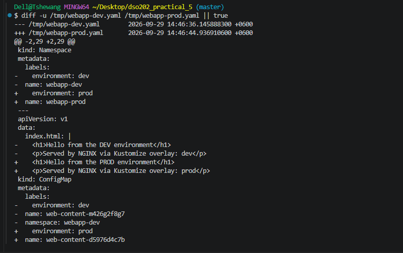

The second half of the diff shows the Deployment differences:

- Image `nginx:1.25-alpine` → `nginx:1.26-alpine`.
- Limits CPU `100m` → `500m`, memory `64Mi` → `256Mi`.
- Requests CPU `50m` → `200m`, memory `32Mi` → `128Mi`.
- The volume now references the prod ConfigMap name.

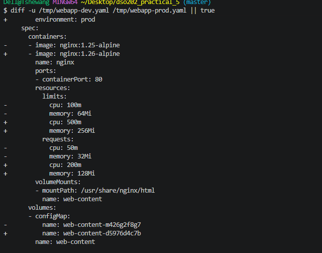

This demonstrates the main benefit of Kustomize: a small, readable set of overlay files produces large and precise differences between environments.

---

## 6. Deploying the Dev Environment

### 6.1 Diff before apply, then apply

```bash
kubectl diff  -k examples/webapp/overlays/dev || true
kubectl apply -k examples/webapp/overlays/dev
```

`kubectl diff` returned `namespaces "webapp-dev" not found`, which is expected because nothing existed yet. `kubectl apply -k` then created the namespace, ConfigMap, Service and Deployment.

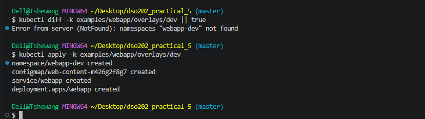

### 6.2 Watching the rollout

```bash
kubectl get all -n webapp-dev
```

Immediately after applying, the pod was in `ContainerCreating` (0/1 ready), with the Service already holding ClusterIP `10.96.221.144`.

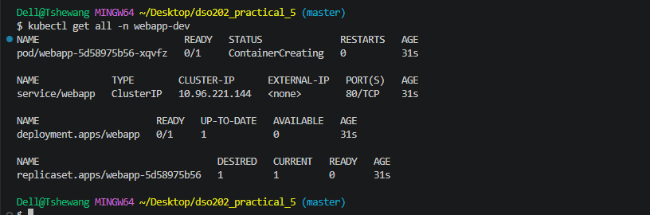

```bash
kubectl get configmap -n webapp-dev
kubectl rollout status deployment/webapp -n webapp-dev
```

The ConfigMap `web-content-m426g2f8g7` exists, and the rollout finished with `deployment "webapp" successfully rolled out`.

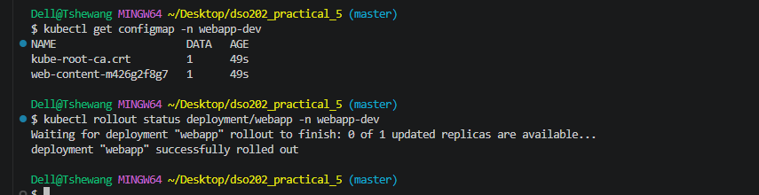

### 6.3 Testing the application

```bash
kubectl port-forward -n webapp-dev service/webapp 8081:80
curl http://127.0.0.1:8081
```

The port-forward accepted connections on 8081, and `curl` returned the dev page.

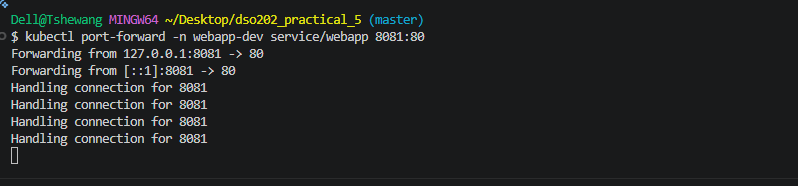

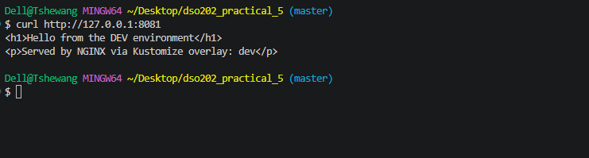

The same page was confirmed in the browser:

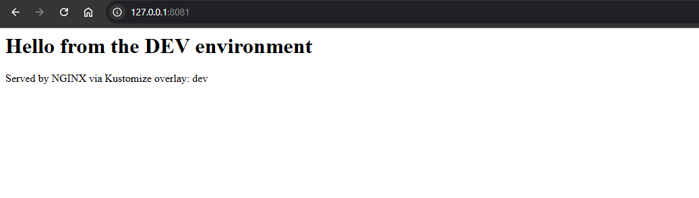

### 6.4 Pod placement

```bash
kubectl get configmap -n webapp-dev
kubectl get pods -n webapp-dev -o wide
```

The pod `webapp-5d58975b56-xqvfz` is `1/1 Running` with 0 restarts, scheduled on `kustomize-lab-worker` at `10.244.2.2`.

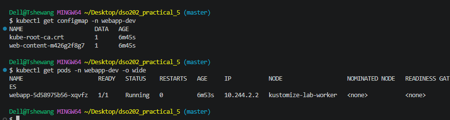

---

## 7. Demonstrating a Configuration Change

To show how ConfigMap changes roll out, the dev `index.html` was edited (it now reads **"DEV v2 — configuration changed"** in the repository) and re-applied:

```bash
kubectl kustomize examples/webapp/overlays/dev | grep 'name: web-content'
kubectl apply -k examples/webapp/overlays/dev
```

Because the ConfigMap content changed, Kustomize generated a **new name** (`web-content-f6b85m6dhg`). The apply output shows `configmap/web-content-f6b85m6dhg created` and `deployment.apps/webapp configured`, while the namespace and Service were `unchanged`.

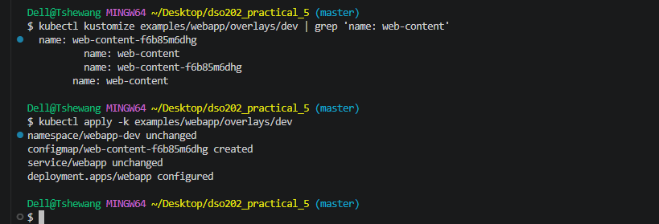

```bash
kubectl rollout status deployment/webapp -n webapp-dev
```

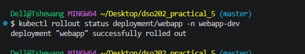

Now both ConfigMaps are present (`web-content-m426g2f8g7` at 9m3s and `web-content-f6b85m6dhg` at 40s), and the old pod was replaced by a new one (`webapp-f67d55f85-52wfr`, age 49s).

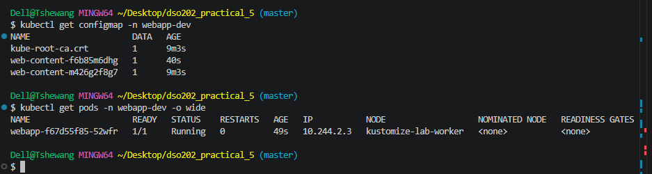

**Why this matters:** A plain ConfigMap edit does not restart pods that already mounted it. By generating a hashed name, Kustomize changes the Deployment's pod template, which forces a controlled rolling update. The old ConfigMap is left in place, so it can be used to roll back.

---

## 8. Deploying Staging and Production

### 8.1 Staging

```bash
kubectl diff  -k examples/webapp/overlays/staging || true
kubectl apply -k examples/webapp/overlays/staging
```

The namespace `webapp-staging`, ConfigMap `web-content-k5ct86f8gf`, Service and Deployment were all created.

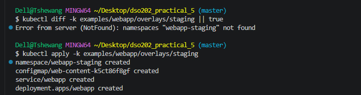

### 8.2 Production

```bash
kubectl diff  -k examples/webapp/overlays/prod || true
kubectl apply -k examples/webapp/overlays/prod
```

The namespace `webapp-prod`, ConfigMap `web-content-d5976d4c7b`, Service and Deployment were created. The ConfigMap name matches the one predicted earlier by the dev/prod diff in Section 5.3.

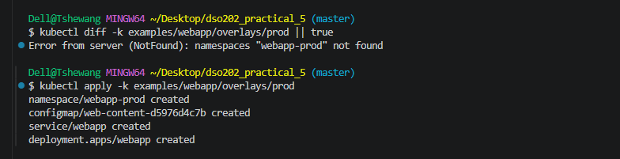

### 8.3 Rollouts

```bash
kubectl rollout status deployment/webapp -n webapp-staging
kubectl rollout status deployment/webapp -n webapp-prod
```

Staging reported "1 of 2 updated replicas are available" before completing, which is normal for a rolling start. Both finished successfully.

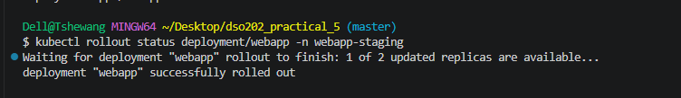

### 8.4 Cross-environment view

```bash
kubectl get deploy -A -l app.kubernetes.io/name=webapp
```

One label selector shows the same application in three namespaces with different replica counts: dev **1/1**, staging **2/2**, prod **3/3**.

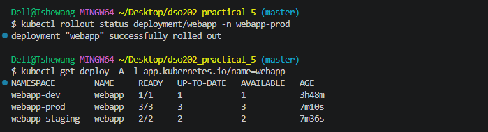

```bash
kubectl get pods -A -l app.kubernetes.io/name=webapp -o wide
```

The pods are spread across both worker nodes. For example the three prod pods are on `kustomize-lab-worker` and `kustomize-lab-worker2`, and the two staging pods are split across the two workers as well.

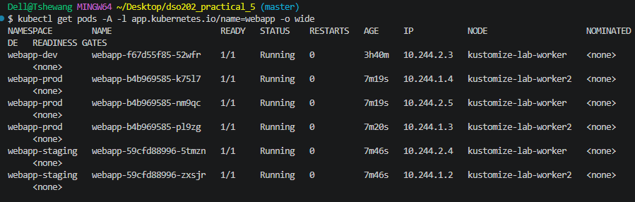

---

## 9. Patches: Production Resources

The prod overlay uses a **strategic merge patch** (`patch-resources.yaml`) to raise container resources and add a `training.example.com/tier: production` annotation:

```bash
cat examples/webapp/overlays/prod/patch-resources.yaml
```

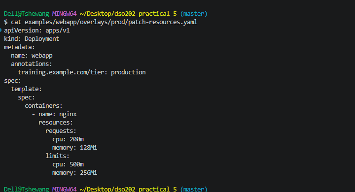

Verifying that the patch is applied in the rendered output:

```bash
kubectl kustomize examples/webapp/overlays/prod | grep -B2 -A8 'resources:'
```

The built manifest shows limits `500m` CPU / `256Mi` memory and requests `200m` CPU / `128Mi` memory, replacing the base values.

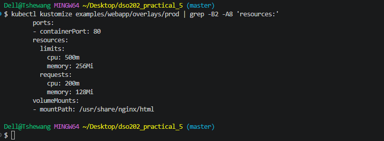

---

## 10. Patches: QA Annotation and Deployment

The QA overlay uses a **JSON 6902 patch** (`patch-annotation.yaml`) with an `add` operation, targeted at the `webapp` Deployment:

```yaml
- op: add
  path: /metadata/annotations
  value:
    training.example.com/owner: qa-team
```

### 10.1 Verify the patch and run a diff

```bash
kubectl kustomize examples/webapp/overlays/qa | grep -B3 -A3 'training.example.com/owner'
kubectl diff -k examples/webapp/overlays/qa || true
```

The rendered Deployment contains the annotation `training.example.com/owner: qa-team` and the label `environment: qa`. The diff fails with `namespaces "webapp-qa" not found`, as expected before the first apply.

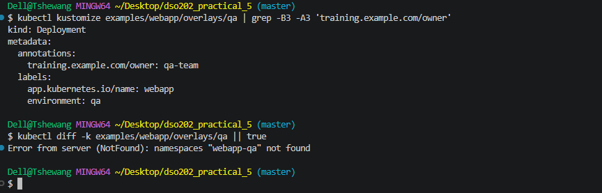

### 10.2 Apply

```bash
kubectl apply -k examples/webapp/overlays/qa
```

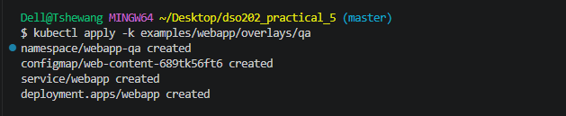

### 10.3 Rollout and pods

```bash
kubectl rollout status deployment/webapp -n webapp-qa
kubectl get pods -n webapp-qa -o wide
```

Two new pods are `Running` on separate workers (`kustomize-lab-worker` and `kustomize-lab-worker2`), while an older pod from a previous ReplicaSet is shown in `Terminating` state as the rollout replaces it.

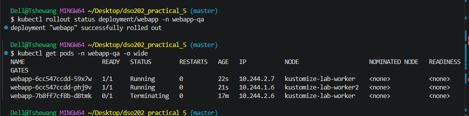

### 10.4 Inspecting the live QA Deployment

```bash
kubectl get deployment webapp -n webapp-qa -o yaml
```

The live object confirms:

- Annotation `training.example.com/owner: qa-team` and label `environment: qa`.
- `deployment.kubernetes.io/revision: "2"` and `generation: 2` (the Deployment has been updated once since creation).
- `replicas: 2`, image `nginx:1.25-alpine`, and the volume pointing at the generated ConfigMap `web-content-689tk56ft6`.

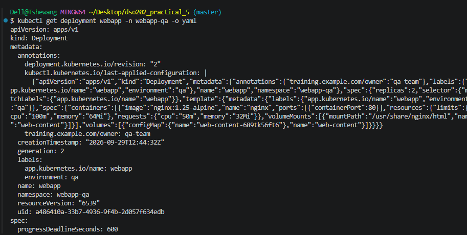

The status block shows `availableReplicas: 2`, `readyReplicas: 2`, `updatedReplicas: 2`, the `Available` condition `True` (reason `MinimumReplicasAvailable`), and `Progressing` `True` (reason `NewReplicaSetAvailable`). `terminatingReplicas: 1` matches the old pod still shutting down.

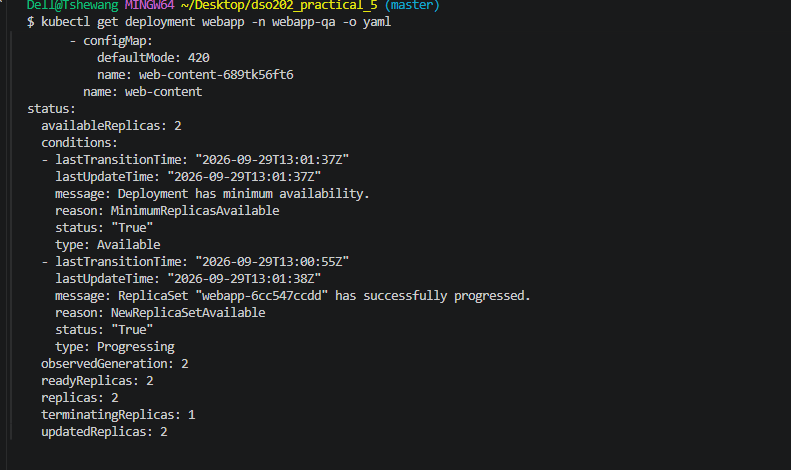

A focused check on just the annotations:

```bash
kubectl get deployment webapp -n webapp-qa -o yaml | grep -A2 annotations
```

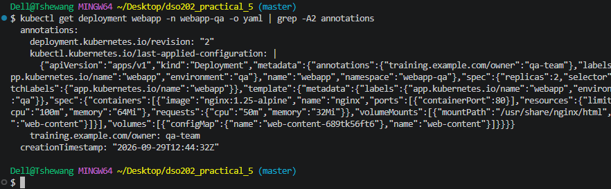

### 10.5 Testing QA in the browser

```bash
kubectl port-forward -n webapp-qa service/webapp 8081:80
```

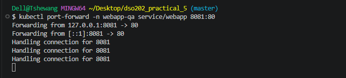

The QA page is served with its own unique content ("Hello from the QA environment – Unique QA page - owned by qa-team"), proving each overlay serves independent content from the same base.

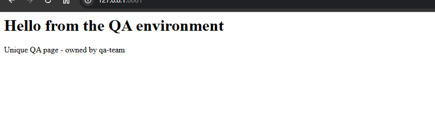

---

## 11. Final State of the Cluster

```bash
kubectl get deploy -A -l app.kubernetes.io/name=webapp
kubectl get pods   -A -l app.kubernetes.io/name=webapp -o wide
```

| Namespace | Ready | Up-to-date | Available |
|---|---|---|---|
| webapp-dev | 1/1 | 1 | 1 |
| webapp-qa | 2/2 | 2 | 2 |
| webapp-staging | 2/2 | 2 | 2 |
| webapp-prod | 3/3 | 3 | 3 |

All four environments run the same application from one base, with replica counts matching each overlay definition, and pods distributed across both worker nodes.

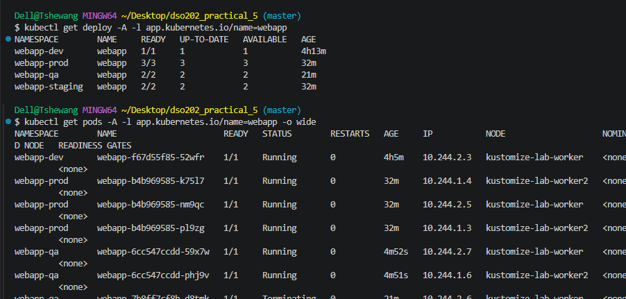

---

## 12. Key Learnings

1. **Base plus overlays removes duplication.** Only the differences live in the overlays; the shared Deployment and Service are written once.
2. **Built-in transformers cover most needs.** `namespace`, `labels`, `replicas`, `images` and `namePrefix` handled most per-environment changes with no patch files at all.
3. **Patches handle the rest.** Prod used a strategic merge patch for resources, and QA used a JSON 6902 patch to add an annotation. Strategic merge is easier to read, while JSON patch targets exact paths.
4. **Generated ConfigMaps trigger safe rollouts.** The content hash in the name changes whenever the file changes, so Deployments referencing it roll out automatically. The hash is also rewritten in every reference (Section 4.2).
5. **Preview before applying.** `kubectl kustomize` and `kubectl diff -k` let you check results first. The "namespace not found" errors from `diff` on a new environment are expected and not a fault.
6. **`diff` between built outputs is a quick audit tool.** Comparing dev and prod (Section 5.3) shows exactly what makes an environment different.

---

## 13. Issues and Observations

| Observation | Explanation / Action |
|---|---|
| `kubectl diff -k` returned `namespaces "..." not found` for dev, staging, prod and QA | Expected on a first deployment; the namespaces did not exist yet. Run with `|| true` so the shell does not stop. |
| Pod stayed in `ContainerCreating` briefly after the first dev apply | Normal while the image is pulled onto the worker node; it reached `Running` shortly after (Section 6.2). |
| An old QA pod appeared as `Terminating` | This is the previous ReplicaSet being scaled down during a rolling update. |
| `kubectl` v1.32.2 vs cluster v1.36.1 | Outside the supported one-minor-version skew, but no problems were seen. Upgrading the client is recommended. |
| Old ConfigMaps remain after a change | Kustomize does not prune them by default. They can be cleaned up manually or with `kubectl apply -k ... --prune` when needed. |
| The `sandbox` overlay has no `namespace.yaml` | It sets `namespace: webapp-sandbox` and a `sandbox-` name prefix but does not create the Namespace. It would need the namespace created first. No deployment screenshots of sandbox are included in the evidence. |

---

## 14. Conclusion

The practical successfully showed how Kustomize manages one application across several environments. A three-node `kind` cluster was created, a shared base was built, and overlays for dev, staging, QA and production were rendered, compared and deployed. The screenshots confirm that namespaces, labels, replica counts, image tags, resource limits, annotations and page content all differ per environment as defined in the overlays, that configuration changes trigger rolling updates through hashed ConfigMap names, and that all deployments ended in a healthy, fully available state.

